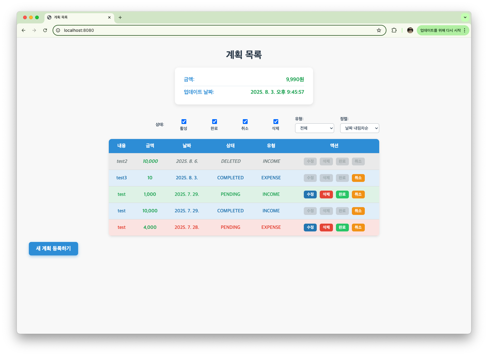
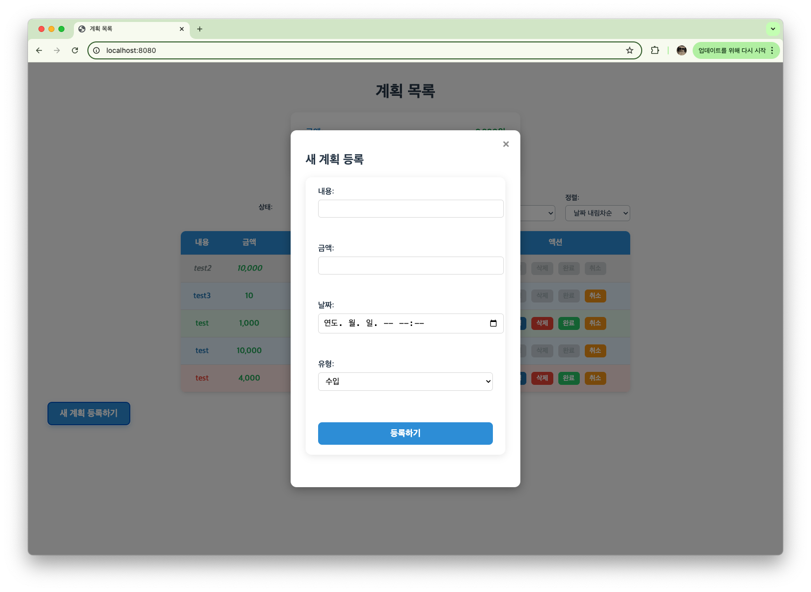

# 계획 목록 관리 웹 애플리케이션

사용자가 수입/지출 계획을 체계적으로 관리할 수 있는 웹 애플리케이션입니다.
실시간 잔액 조회와 다양한 필터링 기능을 통해 효율적인 계획 관리를 지원합니다.

---

## 주요 기능
### 계획 관리
- 계획 CRUD: 계획 등록, 수정, 삭제
- 상태 관리: 활성 → 완료/취소 상태 변경
- 실시간 잔액: 수입/지출에 따른 잔액 자동 계산

### 필터링 & 정렬
- 상태별 필터: 활성, 완료, 취소, 삭제된 계획 분류
- 유형별 필터: 수입, 지출 구분
- 정렬 기능: 날짜, 금액 기준 오름차순/내림차순

### 사용자 인터페이스
- 반응형 테이블: 계획 목록 동적 렌더링
- 모달 UI: 직관적인 계획 입력/수정 폼

  
  

## 기술 스택

### Frontend

- **Language**: HTML5, CSS3, Vanilla JavaScript
- **API**: Fetch API를 활용한 비동기 통신
- **UI**: 모달 팝업, 동적 DOM 조작

### Back-end
- **Language**: Java 17
- **Framework**: Spring Boot 3.5.4
- **ORM**: JPA, QueryDSL
- **API**: RESTful API 설계

### Database
- **RDBMS**: MySQL

---

## 실행 방법

### 사전 요구사항
- Java 17 이상
- MySQL 8.0 이상

### 1. 프로젝트 클론
~~~bash
git clone <repository-url>
cd com.balance.plan
~~~

### 2. 데이터베이스 설정
   MySQL에서 데이터베이스를 생성하고 application.yml 파일을 설정하세요.
~~~yaml
spring:
  application:
    name: plan
  datasource:
    url: jdbc:mysql://localhost:3306/plan_db
    username: your_username
    password: your_password
    driver-class-name: com.mysql.cj.jdbc.Driver

  jpa:
    hibernate:
      ddl-auto: update
    show-sql: true
    properties:
      hibernate:
        format_sql: true

~~~

### 3. 애플리케이션 실행
~~~bash
# 빌드
./gradlew build

# 실행
./gradlew bootRun
~~~

### 4. 접속
브라우저에서 `http://localhost:8080`으로 접속

